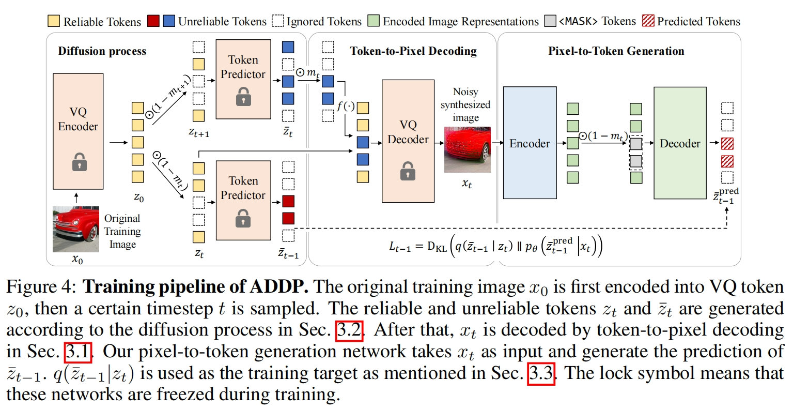
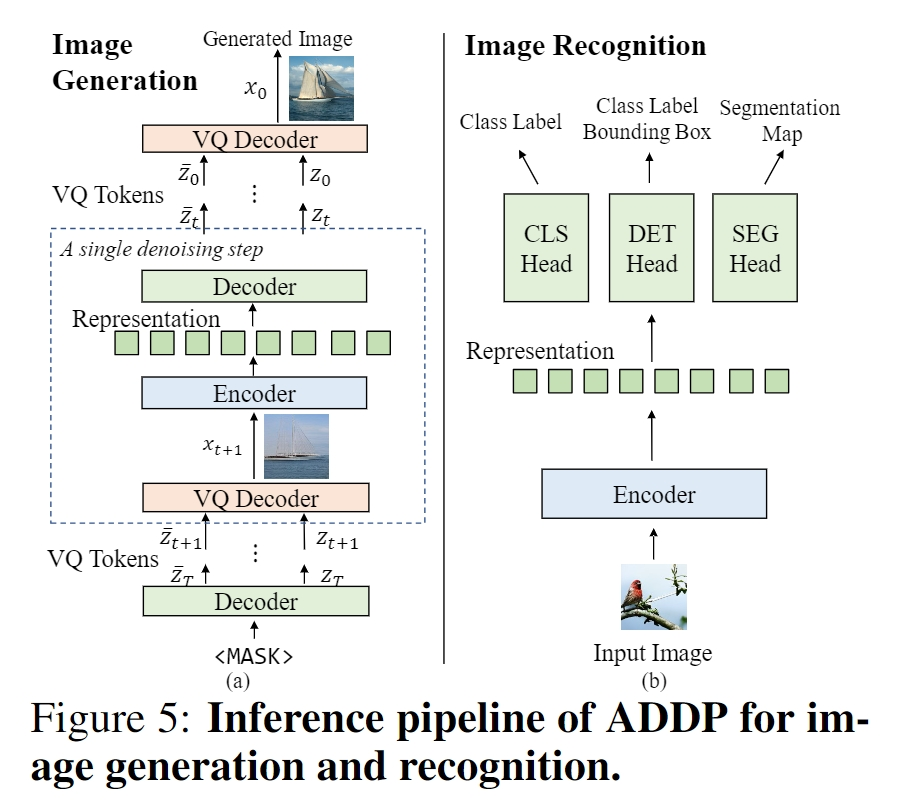

# ADDP
The official implementation of the paper "[ADDP: Learning General Representations for Image Recognition and Generation with Alternating Denoising Diffusion Process](https://arxiv.org/abs/2306.05423)" (ICLR 2024).

The code will be released in this month (03/2024).


## Abstract

Image recognition and generation have long been developed independently of each other. With the recent trend towards general-purpose representation learning, the development of general representations for both recognition and generation tasks is also promoted. However, preliminary attempts mainly focus on generation performance, but are still inferior on recognition tasks. These methods are modeled in the vector-quantized (VQ) space, whereas leading recognition methods use pixels as inputs. Our key insights are twofold: (1) pixels as inputs are crucial for recognition tasks; (2) VQ tokens as reconstruction targets are beneficial for generation tasks. These observations motivate us to propose an Alternating Denoising Diffusion Process (ADDP) that integrates these two spaces within a single representation learning framework. In each denoising step, our method first decodes pixels from previous VQ tokens, then generates new VQ tokens from the decoded pixels. The diffusion process gradually masks out a portion of VQ tokens to construct the training samples. The learned representations can be used to generate diverse high-fidelity images and also demonstrate excellent transfer performance on recognition tasks. Extensive experiments show that our method achieves competitive performance on unconditional generation, ImageNet classification, COCO detection, and ADE20k segmentation. Importantly, our method represents the first successful development of general representations applicable to both generation and dense recognition tasks.


## Method






## Citation

If this work is helpful for your research, please consider citing the following BibTeX entry.

```
@article{tian2023addp,
  title={Addp: Learning general representations for image recognition and generation with alternating denoising diffusion process},
  author={Tian, Changyao and Tao, Chenxin and Dai, Jifeng and Li, Hao and Li, Ziheng and Lu, Lewei and Wang, Xiaogang and Li, Hongsheng and Huang, Gao and Zhu, Xizhou},
  journal={arXiv preprint arXiv:2306.05423},
  year={2023}
}
```


## License

This repository is released under the Apache 2.0 license as found in the [LICENSE](LICENSE.md) file.
